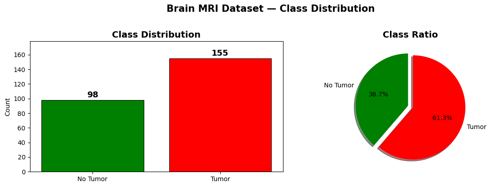
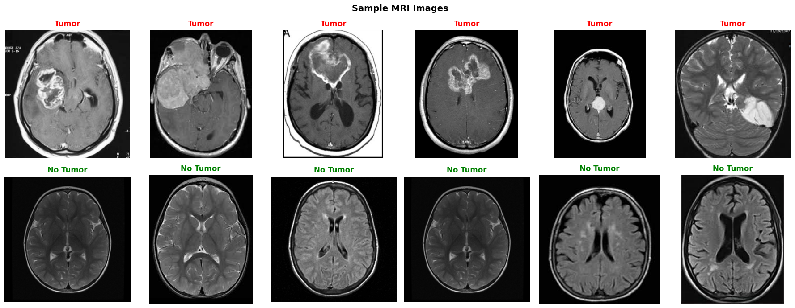
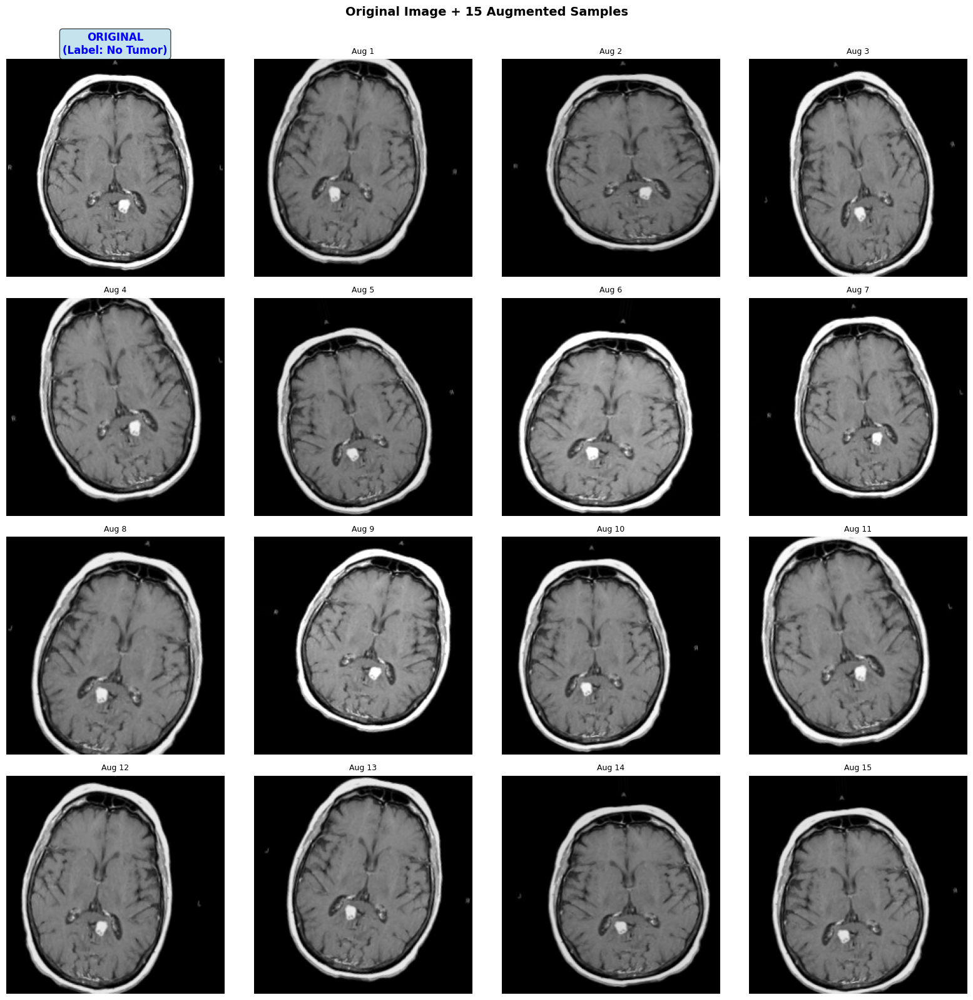
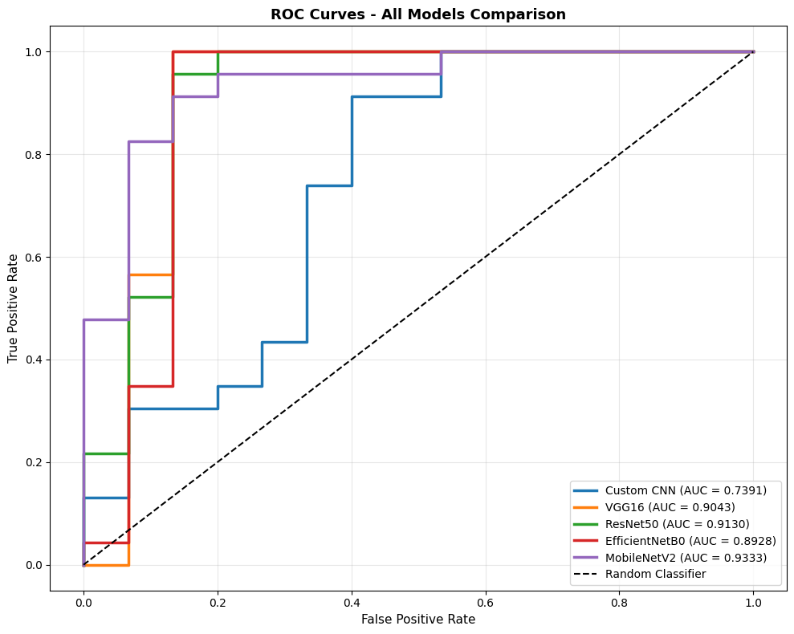

# MRI Brain Tumor Detection — Comparative CNN Study

A comparative study of five convolutional neural network architectures for binary
brain-tumor classification on MRI images. Every model is trained and evaluated
under an identical protocol (stratified 5-fold cross-validation, evaluated on a
held-out test set) so the comparison is fair.

---

## Overview

The goal is not a single classifier but a fair comparison: which architecture
generalizes best on a small, imbalanced MRI dataset, and what transfer learning
buys over a CNN trained from scratch. A custom CNN is used as a baseline against
four ImageNet-pretrained backbones.

---

## Dataset

[Brain MRI Images for Brain Tumor Detection](https://www.kaggle.com/datasets/navoneel/brain-mri-images-for-brain-tumor-detection)
(Kaggle), 253 images total: 155 tumor and 98 no-tumor. The dataset is small and
class-imbalanced, which shapes most of the design decisions below.

- Images resized to 224x224 RGB.
- Stratified split into train / validation / test (177 / 38 / 38), preserving the
  class ratio.

---

## Approach

- **Transfer learning.** Four ImageNet-pretrained backbones (VGG16, ResNet50,
  EfficientNet-B0, MobileNetV2) are compared against a custom CNN baseline, each
  with model-specific input preprocessing.
- **MRI-aware augmentation.** Rotation, small shifts, shear, zoom, brightness
  jitter, and horizontal flip. Vertical flip is intentionally removed because
  brain MRI has a clear top-bottom orientation, and brightness shifts are kept
  mild to avoid distorting the small dataset.
- **Stratified 5-fold cross-validation.** Every model is trained across five
  folds and evaluated on the same held-out test set, so all architectures are
  compared on identical data under the same protocol.

---

## Results

Per-model performance on the held-out test set:

| Model            | Accuracy | Precision | Recall | F1       | ROC-AUC | Specificity |
| ---------------- | -------- | --------- | ------ | -------- | ------- | ----------- |
| Custom CNN       | 0.789    | 0.778     | 0.913  | 0.840    | 0.739   | 0.600       |
| VGG16            | 0.947    | 0.920     | 1.000  | **0.958**| 0.904   | 0.867       |
| ResNet50         | 0.921    | 0.917     | 0.957  | 0.936    | 0.913   | 0.867       |
| EfficientNet-B0  | 0.947    | 0.920     | 1.000  | **0.958**| 0.893   | 0.867       |
| MobileNetV2      | 0.895    | 0.880     | 0.957  | 0.917    | 0.933   | 0.800       |

VGG16 and EfficientNet-B0 led with 0.958 F1 and 94.7% accuracy, both reaching
perfect recall (sensitivity 1.000), which matters most here since a missed tumor
is the costliest error, at 0.867 specificity.

---

## Key findings

- All pretrained backbones clearly outperformed the from-scratch CNN, which is
  expected on a dataset this small.
- VGG16 and EfficientNet-B0 were the strongest on accuracy and F1 (0.947 / 0.958),
  both with perfect recall, while MobileNetV2 had the highest ROC-AUC (0.933).
- EfficientNet-B0 matched VGG16's top scores at a fraction of the parameters,
  making it the best accuracy-to-size trade-off for deployment.
- The test set is small, so scores should be read as a relative ranking between
  architectures rather than precise absolute performance.

---
